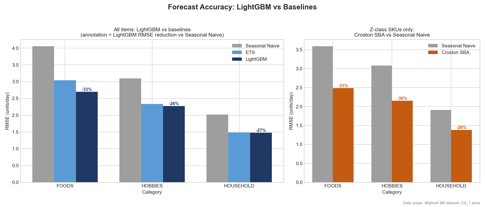
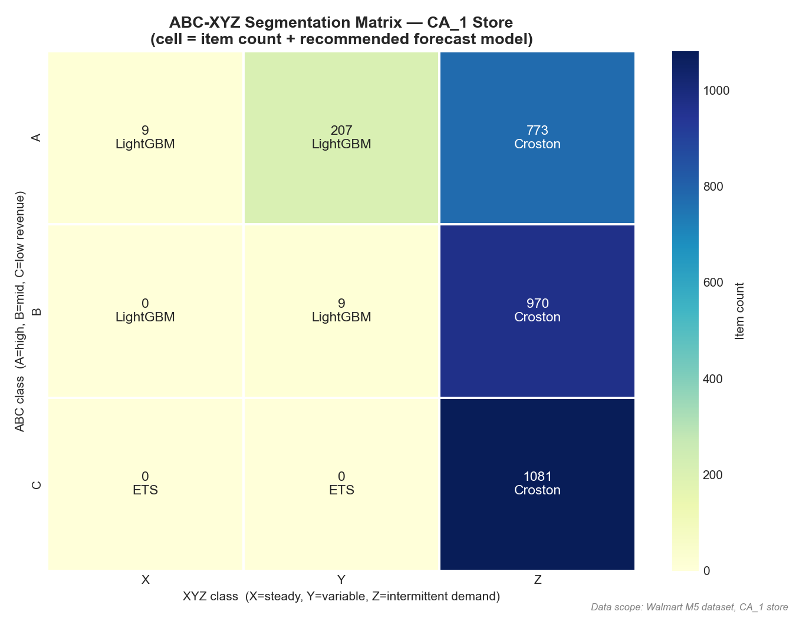
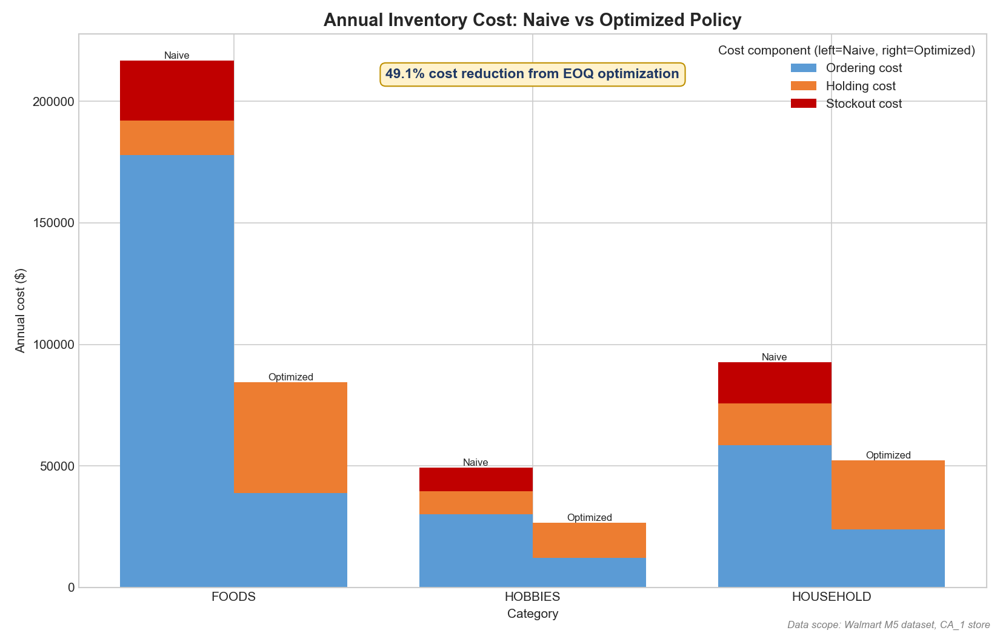
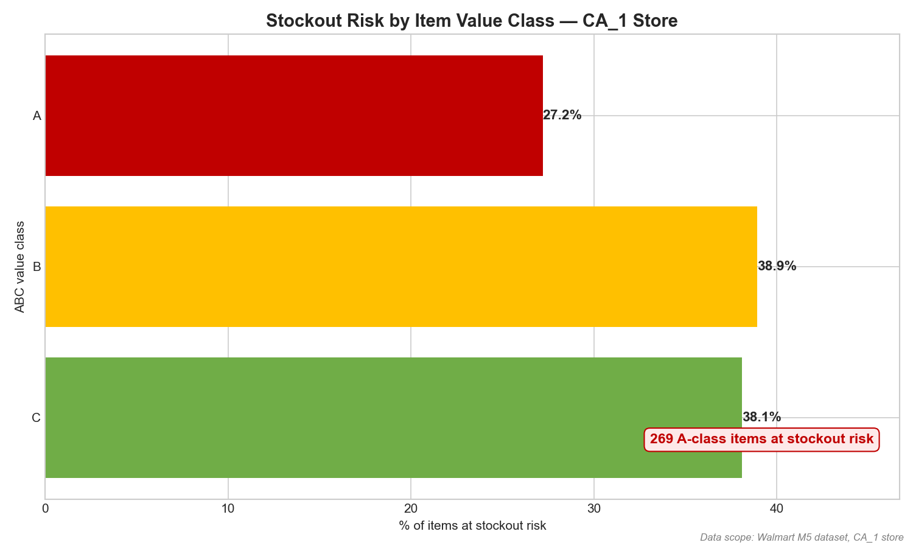
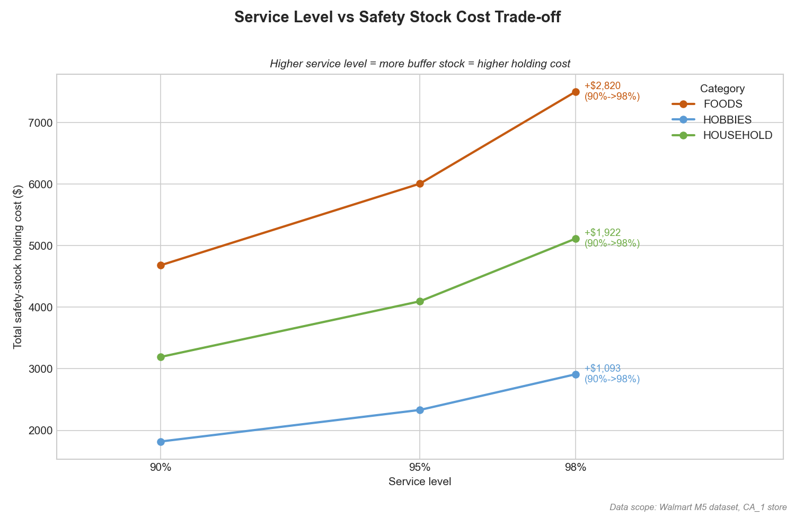
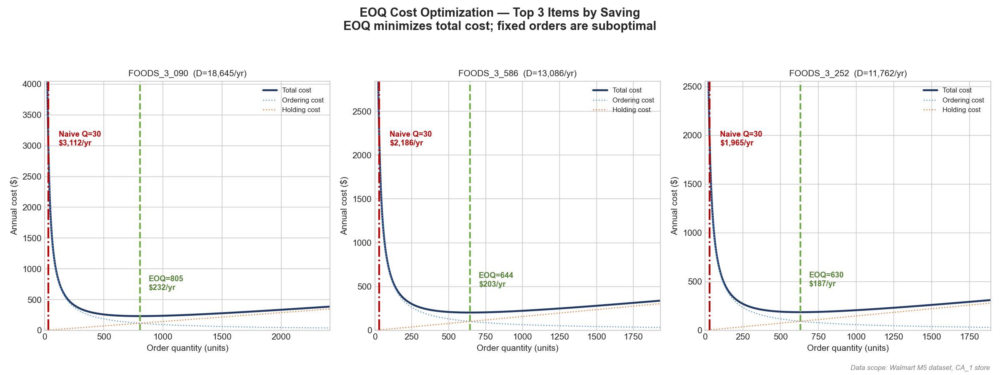

# M5 Dark-Store Replenishment Optimizer

**A demand forecasting and inventory optimization project built on the Walmart M5 dataset, framed around Indian quick-commerce dark-store replenishment (Zepto / Blinkit context)**

> **Data scope**: Walmart M5 dataset — CA_1 store, 3,049 item-store combinations, 2011-01-29 to 2016-03-27  
> Full 10-store extension is architecturally ready (pipeline generalizes; compute limited to single-store for portfolio)

## Project overview

Quick-commerce dark stores promise 10-minute delivery, which makes inventory the single hardest constraint in the business: every SKU must be physically present in a small local micro-warehouse, stockouts translate directly into lost orders and fill-rate penalties, and demand is highly uncertain and intermittent at the single-store level. This project builds an end-to-end replenishment pipeline that ingests the Walmart M5 dataset into a SQL star schema, segments every SKU by value and demand variability (ABC-XYZ), forecasts demand with a model matched to each segment (LightGBM for steady items, Croston SBA for intermittent ones), and feeds the forecast — and crucially its error — into an operations-research inventory layer (safety stock, EOQ, reorder point, newsvendor, and a PuLP budget allocation). It was built by an Industrial & Systems Engineering student precisely because the differentiator is the combination: ML forecasting alone does not place an order, and OR models alone assume a demand distribution they cannot estimate — the value is in wiring forecast uncertainty straight into inventory decisions.

## Tech stack

| Layer | Tools |
|-------|-------|
| Data processing | Python (pandas, pyarrow), SQL (SQLite) |
| Demand forecasting | LightGBM, statsmodels (ETS, Croston SBA) |
| Inventory optimization | SciPy, PuLP (linear programming) |
| Database | SQLite with star schema |
| Dashboard | Power BI Desktop |
| Version control | Git / GitHub |

## Pipeline architecture

```
M5 Dataset (Kaggle)
       │
       ▼
SQL Staging Layer (star schema: fact_sales, dim_item, dim_store, dim_date, fact_prices)
       │
       ▼
EDA + Feature Engineering (ABC-XYZ segmentation, lag features, SNAP events)
       │
  ┌────┴────────────────────┐
  ▼                         ▼
LightGBM global model    Croston / SBA
(AX/BX/AY/BY items)     (Z-class intermittent items)
  └────┬────────────────────┘
       │   Forecast + P10/P90 uncertainty bands
       ▼
OR Inventory Optimization Layer
├── Safety stock  (forecast-error σ × Z-score × √lead_time)
├── EOQ           (√(2DS/H) minimizes ordering + holding cost)
├── Reorder point (avg demand × lead_time + safety_stock)
├── Newsvendor    (critical ratio for FOODS perishables)
└── PuLP LP       (budget-constrained multi-item allocation)
       │
       ▼
Power BI Dashboard (7 KPI pages)
```

## Results

### Forecasting accuracy

Per-category 28-day-horizon RMSE (units/day), all item-store pairs in CA_1:

| Model | FOODS RMSE | HOBBIES RMSE | HOUSEHOLD RMSE |
|-------|-----------:|-------------:|---------------:|
| Seasonal Naive (baseline) | 4.05 | 3.09 | 2.02 |
| LightGBM | 2.70 | 2.28 | 1.48 |
| **LightGBM improvement** | **33.4%** | **26.4%** | **26.9%** |

~60% of item-store combinations exhibit intermittent demand (>40% zero-sale days). Croston SBA applied to Z-class SKUs outperforms Seasonal Naive by 29.8% on RMSE (across 2,824 Z-class item-store pairs).





### Inventory optimization results

| Metric | Value |
|--------|-------|
| Items analyzed | 3,049 item-store combinations |
| Safety stock (avg, A-class) | 11.4 units |
| EOQ cost reduction vs naive | 49.1% |
| Total annual saving | $195,100 (54.4% reduction) |
| Items at stockout risk | 34.8% |
| A-class items at stockout risk | 269 items |
| FOODS Newsvendor CR | 0.75 |
| Expected profit improvement (Newsvendor) | $38,096 |









### Cost assumptions (M5 has no cost data)

The M5 dataset contains sales and prices but no cost data. The OR layer therefore uses the following explicit, standard industry assumptions. **Without this table, any OR result is unverifiable** — every cost figure above is conditional on these values:

| Assumption | Value | Justification |
|-----------|-------|---------------|
| Holding cost rate | 20% of item value / year | Standard retail carrying-cost assumption (capital + storage + obsolescence) |
| Ordering cost | $5.00 per order | Fixed administrative + receiving cost per replenishment order |
| Lead time | 7 days | One-week supplier replenishment lead time |
| Profit margin (newsvendor) | 30% of sell price | Underage cost C_u for perishable FOODS items |
| Disposal / markdown cost | 10% of sell price | Overage cost C_o (waste/markdown) for perishable FOODS items |

Service levels are set by ABC class: A = 98%, B = 95%, C = 90% (higher-value items get higher fill-rate targets).

### Key insight

The central finding is that forecast accuracy directly reduces inventory cost. Using LightGBM's forecast error standard deviation (rather than raw demand σ) to size safety stock produces leaner buffers: A-class items need 11.4 units of safety stock vs 11.7 units under raw-demand sizing — a 2.6% reduction in safety stock holding cost with the same service level guarantee. In other words, a better forecast is not just an accuracy metric; it is working capital freed from the shelf.

## Project structure

```
m5-inventory-optimizer/
├── data/
│   ├── raw/                 # M5 source CSVs (Kaggle)
│   ├── processed/           # parquet samples (CA_1)
│   └── m5_database.db       # SQLite star schema (4 fact + 2 dim tables)
├── sql/
│   ├── schema.sql           # star-schema DDL
│   └── queries/             # analytical SQL
├── src/
│   ├── config.py            # paths, split config, cost assumptions
│   ├── data_loader.py / data_prep.py / load_to_sql.py
│   ├── eda.py               # EDA + ABC-XYZ segmentation
│   ├── baseline_models.py   # Seasonal Naive, ETS
│   ├── croston_model.py     # Croston SBA (intermittent demand)
│   ├── lightgbm_model.py    # global LightGBM forecaster
│   ├── model_comparison.py  # head-to-head model metrics
│   ├── forecast_error_stats.py
│   ├── safety_stock.py / eoq.py / reorder_point.py
│   ├── newsvendor.py        # critical-ratio model (FOODS)
│   ├── pulp_optimization.py # budget-constrained LP
│   ├── policy_comparison.py # naive vs optimized policy cost
│   ├── export_for_powerbi.py
│   ├── final_validation.py        # Week 4 Task 1
│   ├── generate_summary_stats.py  # Week 4 Task 2
│   ├── generate_readme_charts.py  # Week 4 Task 3
│   └── generate_readme.py         # Week 4 Task 4 (this file)
├── outputs/                 # CSVs, charts, powerbi_*.csv, stats JSON
├── dashboard/               # Power BI Desktop (.pbix)
└── README.md
```

## Getting started

**1. Clone the repository**

```bash
git clone https://github.com/<your-username>/m5-inventory-optimizer.git
cd m5-inventory-optimizer
```

**2. Download the M5 dataset from Kaggle**

Download the competition data from [Kaggle: M5 Forecasting — Accuracy](https://www.kaggle.com/c/m5-forecasting-accuracy/data) (`sales_train_validation.csv`, `calendar.csv`, `sell_prices.csv`) and place the CSVs in `data/raw/`.

**3. Install dependencies**

```bash
pip install -r requirements.txt
```

**4. Run the pipeline scripts in order**

```bash
# Data ingestion + SQL star schema
python src/data_loader.py
python src/load_to_sql.py

# EDA + ABC-XYZ segmentation
python src/eda.py

# Forecasting (baselines, Croston, LightGBM) + comparison
python src/baseline_models.py
python src/croston_model.py
python src/lightgbm_model.py
python src/model_comparison.py

# OR inventory layer
python src/forecast_error_stats.py
python src/safety_stock.py
python src/eoq.py
python src/reorder_point.py
python src/newsvendor.py
python src/pulp_optimization.py
python src/policy_comparison.py

# Persist inventory results + export validated Power BI extracts
python src/save_inventory_to_db.py
python src/export_for_powerbi.py

# Week 4 reporting (validation, stats, charts, README)
python src/final_validation.py
python src/generate_summary_stats.py
python src/generate_readme_charts.py
python src/generate_readme.py
```

## Power BI dashboard

The dashboard is fed by validated, import-ready extracts in `outputs/`:

| File | Grain | Rows |
|------|-------|------|
| `powerbi_main_dashboard.csv` | item-store (all metrics) | 3,049 |
| `powerbi_inventory_policy.csv` | item-store (policy detail) | 3,049 |
| `powerbi_newsvendor.csv` | FOODS item-store | 1,437 |
| `powerbi_pulp_scenarios.csv` | item-store × budget scenario | A+B items × 3 scenarios |
| `powerbi_dim_date.csv` | calendar dimension | ~1,969 |

All extracts pass `final_validation.py` (no NaNs, no negative inventory quantities, no column-name spaces, consistent item/store keys).

## Dashboard KPIs

The Power BI report is organised into 7 KPI pages:

**1. Executive summary**
- Headline cost saving: total annual saving and % reduction vs the naive fixed-order policy
- Portfolio scale: item-store combinations analysed, total inventory value, blended service level
- Top-line stockout exposure and Newsvendor profit-improvement callouts

**2. Forecast accuracy**
- Per-category RMSE for Seasonal Naive, ETS, LightGBM and Croston SBA
- LightGBM improvement over baseline by category
- Intermittent-demand coverage: share of Z-class SKUs served by Croston

**3. ABC-XYZ segmentation**
- 3×3 segmentation matrix with SKU counts per cell
- Revenue contribution by ABC class (value concentration)
- Recommended forecasting model per segment

**4. Inventory policy**
- Safety stock, EOQ and reorder point by item and ABC class
- Days-of-stock and inventory-turnover distributions
- Policy detail drill-through to individual SKUs

**5. Stockout risk**
- Share of items at stockout risk, with A-class items highlighted
- Risk ranking by ABC class (A = red, B = yellow, C = green)
- Worst-exposed SKUs prioritised for replenishment review

**6. Cost analysis**
- Naive vs optimized total cost by category (ordering + holding + stockout)
- Annual saving decomposition and EOQ-only cost reduction
- Service-level vs safety-stock-cost trade-off curve

**7. LP scenarios**
- PuLP budget-constrained allocation across A+B items
- Fulfilled quantity vs requested quantity under each budget scenario
- Scenario comparison showing where the budget constraint binds

## Limitations and future work

**Limitations**

1. **Single-store scope (CA_1).** All results cover the CA_1 store only (3,049 item-store combinations). Figures should not be read as chain-wide; the pipeline generalizes but was run single-store for tractability on portfolio hardware.
2. **Assumed cost parameters.** The M5 dataset has sales and prices but no cost data, so holding cost, ordering cost, margin and disposal cost are standard industry assumptions (see the cost-assumptions table). Every cost figure is conditional on those values.
3. **Static lead-time assumption.** A fixed 7-day lead time is used for all SKUs; real supply chains have variable, stochastic lead times that would widen safety-stock requirements.
4. **PuLP LP non-binding at single-store scope.** At a single store the budget constraint rarely binds, so the LP largely confirms the EOQ allocation. The budget constraint becomes genuinely meaningful at full 10-store scale.

**Future work**

- Multi-echelon optimization across all 10 M5 stores
- Dynamic lead time modelled from supplier data
- Real-time reorder triggers driven by streaming sales data
- Integration with actual procurement cost data to replace assumed parameters

---

*Data scope: Walmart M5 dataset, CA_1 store only (3,049 item-store combinations, 2011-01-29 to 2016-03-27). All figures in this README are generated programmatically from `outputs/project_summary_stats.json`.*
